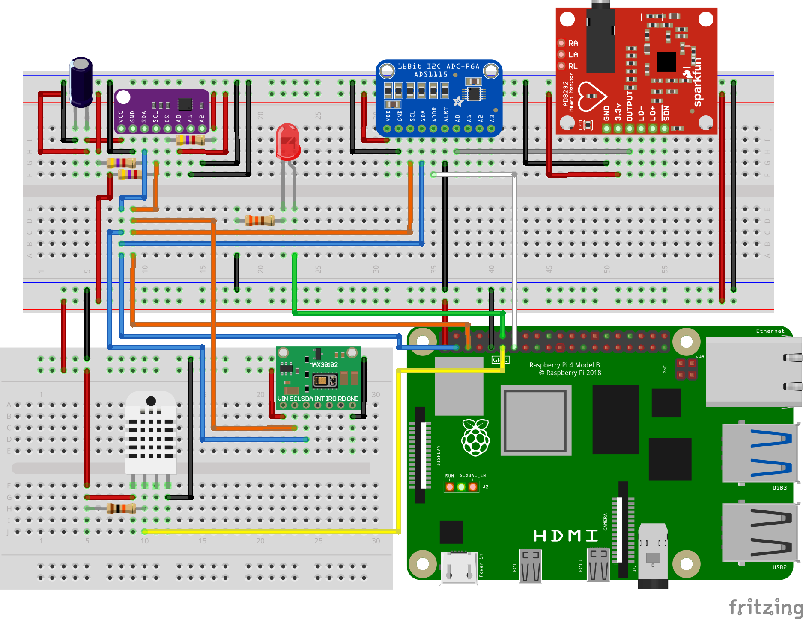
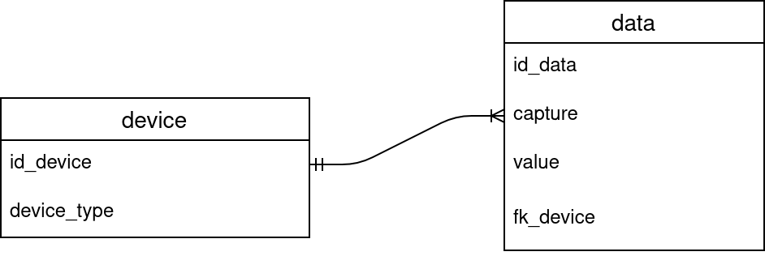

# Table of Contents

- [Table of Contents](#table-of-contents)
- [About](#about)
- [Raspberry Pi](#raspberry-pi)
- [Database](#database)
- [API](#api)
- [App](#app)

# About

A smart home system with Raspberry Pi, PostgreSQL, Docker, Flask, GraphQL, and Flutter.

The project consists of 4 main components:

- Capturing data from the sensors using Raspberry Pi
- Database for data storage
- API for storing and retrieving data
- Mobile app for displaying values

Project infrastructure:


# Raspberry Pi

<div align="center">
  
  
</div>

Raspberry Pi is responsible to get the data from the DHT22 sensor (temperature, humidity) and from the BMP280 sensor (air pressure) every 15 minutes - by using **cron**. After that, it uploads data to the API by calling an appropriate mutation:

```
mutation AddData($value: Float!, $device_type: DeviceType!) {
    addData(value: $value, device_type: $device_type) {
        success
        error
    }
}
```

In case of errors, the LED is turned on. In addition to that, Raspberry Pi also sends an email, and thus notifies the system admin about the occurred error with the following syntax:

```
Error: <error>
Date: <date of error>
```

Sensor schematic:
<div align="center">
  
</div>

<br>

In addition, the system uses the following sensors:
- MAX30102 - heart-rate and oxygen level
- AD8232 - ECG
- MAX30205 - body temperature

More circuit design images can be seen [here](/images/circuit-designs/).

# Database

<div align="center">
  
  
</div>

For the relational database management system, we choose PostgreSQL. In the database, we are storing information about the device and data capture.

ER diagram can be seen from the following image:

<div align="center">
  
</div>

# API

<div align="center">
  
  
  
  
  
  
 
 
 
 
</div>

The API was made with a python framework **flask** with GraphQL and returns data in JSON format. The API is hosted on Heroku, and it's running inside a docker container. To make the API production-ready, we used the **gunicorn** server.

To prevent unauthorized access, we use API keys along with the HTTPS protocol - provided by Heroku.

Main method:

```python
def valid():
    return False if request.headers.get('X-API-Key') != app.config["KEY"] else True

def invalid_req(message, code):
    return jsonify({'error': message, 'success': False}), code

@app.route("/graphql", methods=["POST"])
def graphql_server():
    if not valid():
        return invalid_req('api key not given or invalid', 401)

    data = request.get_json()
    success, result = graphql_sync(
        schema,
        data,
        context_value=request,
        debug=app.debug
    )
    return jsonify(result), 200 if success else 400
```

# App

<div align="center">
  
  
</div>

The mobile app was made with Flutter and Dart. The main app functionality is getting data from the API and displaying it.

The app features the latest, average, median, standard deviation, all today's values along with maximum and minimum values. It also includes a graph with all today's values.

More images can be seen [here](/images/app/).

<div align="center">
  
</div>
